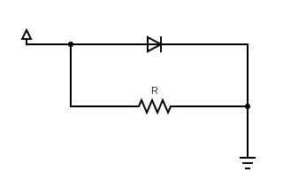
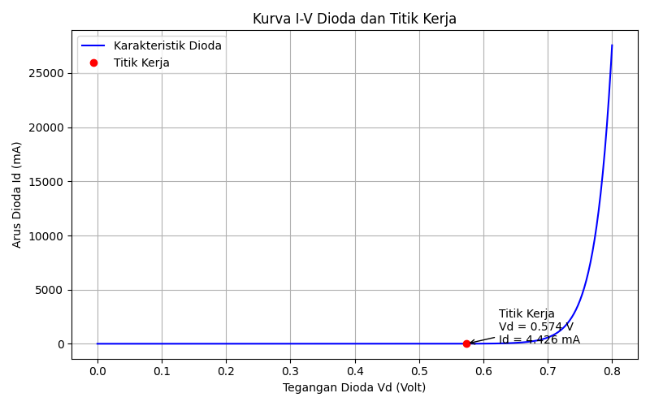

# Diode Operating Point Calculation using Newton-Raphson in C

This project calculates the **operating point** (titik kerja) of a nonlinear diode circuit using the **Newton-Raphson method**. The diode equation is nonlinear due to the exponential relationship between current and voltage, and this tool solves it iteratively with user-defined parameters.

## Circuit Diagram



We are testing using basic nonlinear diode circuit with custom variable that you input to the program.

---

## How to Compile (C)

Compile using GCC with math library:

```bash
gcc dioda_operating_point.c -o dioda -lm
````

---

## How to Run

After compiling:

```bash
./dioda
```

The program will prompt for these inputs:

* `Vin` – Input voltage (in volts)
* `R` – Resistance (in ohms)
* `Is` – Saturation current (in amperes)
* `n` – Ideality factor (usually between 1 and 2)
* `Vt` – Thermal voltage (typically around 0.02585 V)

---

## Input Format Notes

| Parameter | Description            | Example        |
| --------- | ---------------------- | -------------- |
| Vin       | Input voltage (V)      | `5.0`          |
| R         | Resistance (Ω)         | `1000`         |
| Is        | Saturation current (A) | `1e-12`        |
| n         | Ideality factor        | `1.0` or `1.5` |
| Vt        | Thermal voltage (V)    | `0.02585`      |

**Note:** Is must be entered in scientific notation, e.g., `1e-12`.

---

## Example Test Cases

### Test Case 1 – Common Silicon Diode

| Parameter | Value   |
| --------- | ------- |
| Vin       | 5.0     |
| R         | 1000    |
| Is        | 1e-12   |
| n         | 1.0     |
| Vt        | 0.02585 |

**Expected Output:**

```
Tegangan Dioda (Vd)  = 0.574147 V  
Arus Dioda (Id)      = 4.425853e-003 A
```

---

### Test Case 2 – Lower Supply Voltage

| Parameter | Value   |
| --------- | ------- |
| Vin       | 3.3     |
| R         | 1000    |
| Is        | 1e-12   |
| n         | 1.0     |
| Vt        | 0.02585 |

**Expected Output:**

```
Tegangan Dioda (Vd)  = 0.561736 V  
Arus Dioda (Id)      = 2.738264e-003 A
```

---

## Output File

The program also saves final results to:

```
dioda_output.txt
```

---

## Visualizing with Python

You can visualize the diode’s I-V curve and operating point using the included Python script.

### 1. Install Requirements

Make sure Python is installed, then install the required libraries:

```bash
pip install matplotlib numpy
```

### 2. Run the Plotting Script

After running the C program and generating `dioda_output.txt`, run the script:

```bash
python plot_diode.py
```

This will display the I-V characteristic curve and highlight the operating point.
It also saves the graph to:

```
img/iv_curve.png
```
### 3. Plot Example (Result for test-case 1)

---

## Project Report

See the full project report and analysis in the following PDF (only available in Bahasa Indonesia):

[ProyekUAS\_2306161883\_Abednego.pdf](./ProyekUAS_2306161883_Abednego.pdf)

---

## License

MIT License

